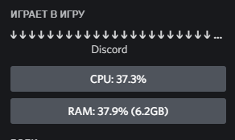
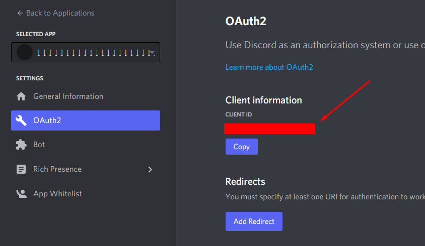

# Discord-CPU-RAM-rich-presence

<h3> to make yourself CPU/RAM rich presence you need to take a few simple steps <h3>
    

1. create an application in Discord Developer [page](https://discord.com/developers/applications)

⠀⠀⠀i would recommend to name the app (↓ ↓ ↓ ↓ ↓ ↓ ↓ ↓ ↓ ↓ ↓ ↓ ↓ ↓ ↓ ↓ ↓ ↓ ↓ ↓ ↓ ↓ ↓ ↓ ↓)

⠀⠀⠀as it will look good, but you can name the app whatever you want
    
3. copy your client id from oAuth2
    
4. replace the standard text in client_id.txt with yours id
5. install pypresence and psutil
    

pip install pypresence
    
pip install psutil
